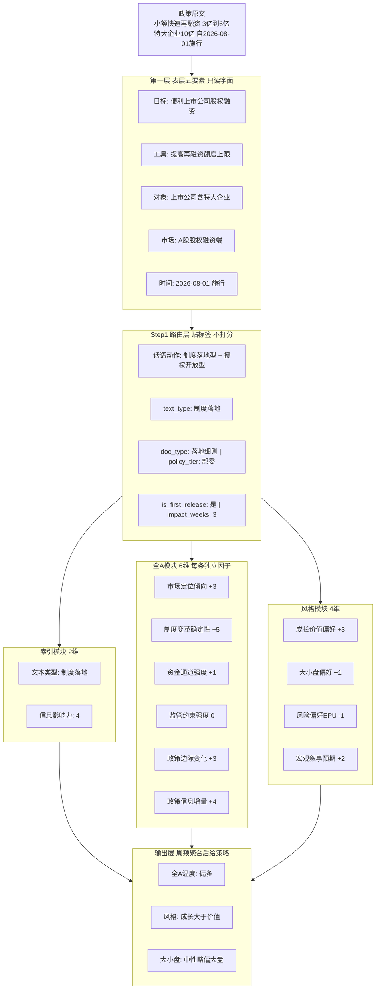

# 0709 子课题1综述：基于「发声主体—受众—话语动作」的文本维度框架

> 创建：2026-07-10
> 用途：子课题1（全A市场及风格类）维度设计的**上层母框架**；从「谁对谁说、在做什么」推导政策文本应提取什么信息，并与学长股吧/机构调研课题对照。
> 关联：[`Review_全A市场及风格类_LLM维度_V260709.md`](文献综述/Review_全A市场及风格类_LLM维度_V260709.md)、[`0709-文献raw.md/文献raw.md`](0709-文献raw.md/文献raw.md)、[`results_summary.pdf`](results_summary.pdf)、[`机构调研文本LLM评分维度研报综述.pdf`](机构调研文本LLM评分维度研报综述.pdf)

---

## 一、核心命题（从对话提炼）

文本研究不应先问「我要打几个分」，而应先问：

> **谁在说？对谁说？说这句话是在完成什么动作？**

然后再问：

> **这个动作里最值得提取的信息是什么？**

不同金融文本的区别，不是「这里有情绪、那里有经营、那里有政策」，而是**它们在资本市场里承担的话语行动（speech act）不同**。维度不应凭空设定，而应从**说话关系 + 说话动作**中推导出来。

---

## 二、发声主体与文本类型映射

### 2.1 五类核心主体（+ 补充）

| 主体                      | 说明                         | 是否合并                                                 |
| ------------------------- | ---------------------------- | -------------------------------------------------------- |
| **散户/公众**       | 股吧、雪球、社媒             | —                                                       |
| **上市公司**        | 披露、答问询、业绩说明       | —                                                       |
| **卖方分析师**      | 研报、点评、路演             | —                                                       |
| **买方/机构投资者** | 调研提问、配置决策           | 可与卖方在「机构侧」对举，调研场景下与卖方合并为「机构」 |
| **政府/监管**       | 国务院、证监会、交易所、部委 | 交易所可并入监管侧                                       |

**建议补充的边缘角色：**

| 主体          | 处理建议                | 原因                                                       |
| ------------- | ----------------------- | ---------------------------------------------------------- |
| 媒体/财经平台 | 并入政策/财经新闻样本池 | 放大、筛选、框定政策意义；与监管原文合并为`policy_block` |
| 中介机构      | 可选                    | 审计、律所、评级在发行/监管文本中重要                      |
| KOL/自媒体    | 并入散户/媒体           | 股吧、非法荐股监管相关                                     |

### 2.2 主体 × 受众 × 文本类型 × 话语动作

| 文本类型                | 说话人 → 受众                                    | 话语动作                                                                 | 学长/文献对应                                               |
| ----------------------- | ------------------------------------------------- | ------------------------------------------------------------------------ | ----------------------------------------------------------- |
| **股吧/雪球讨论** | 散户 → 散户                                      | **讨论、传播、炒作、质疑、抱团、分歧**                             | 学长股吧六维（results_summary）                             |
| **机构调研**      | 上市公司 ↔ 机构/分析师                           | **询问、解释、追问、回应、信息披露**                               | 学长机构调研 17 维                                          |
| **年报 MD&A**     | 上市公司 → 投资者/监管                           | **披露、解释、归因、展望、风险提示**                               | 中金、国联 20 维等                                          |
| **卖方研报**      | 卖方 → 买方/机构                                 | **解读、预测、推荐、说服、构建叙事**                               | 一致预期、假设、催化剂                                      |
| **政策/财经新闻** | 政府/监管 → 市场主体；媒体 → 投资者（转述政策） | **通知、授权、约束、引导、规训、动员、定调；转述、放大、框定意义** | **子课题1 主样本**（政策原文 + 权威媒体转述合并处理） |

> **政策与财经新闻为何合并？** 子课题1关心的是「制度信息如何传导到全A/风格」，权威财经媒体对政策的报道本质上是**同一政策事件的二次传播**——媒体不创造规则，但会**筛选、强调、框定**政策哪一部分更重要。工程上可把「政策原文 + 当日/当周权威媒体报道」拼成同一 `policy_block` 再打分；话语动作上须区分**原文动作**（通知/约束等）与**媒体动作**（转述/放大），但样本池和聚合口径统一。

---

## 三、三层信息提取模型

以下用**同一条政策文本**贯穿三层，避免抽象罗列。

### 贯穿示例（先读原文）

> **《关于常态化打击题材炒作、引导长期资金入市的监管安排（节选，示意）》**
>
> 一、自 2026 年 7 月 6 日起施行，**严厉打击**利用 AI 概念、算法操纵等方式进行的**非法荐股、题材炒作**行为，对情节严重的依法**顶格处罚**。
> 二、**研究**扩大做市商制度覆盖范围，提升 ST 股票等品种的交易流动性。
> 三、**引导**保险资金、养老金、银行理财等**长期资金**加大 A 股配置，**支持**人工智能、生物制造等领域优质企业上市融资。

读完后可预期：这条文本会同时触发**监管约束**（打击炒作）、**制度落地**（施行日期）、**预期释放**（研究做市）、**资金动员**（长期资金）和**成长背书**（AI/生物制造上市）——三层分别回答「说了什么」「在做什么」「对市场意味着什么」。

---

### 3.1 第一层：表层内容（命题信息）

**回答：文本**字面**说了什么？**（不猜意图、不判多空）

用上面示例逐项拆：

| 表层维度  | 示例文本里**能直接读到**的内容                          |
| --------- | ------------------------------------------------------------- |
| 政策目标  | 规范交易秩序、引导长期资金、支持科创融资                      |
| 政策工具  | 顶格处罚、扩大做市、引导配置、支持上市                        |
| 作用对象  | 非法荐股/题材炒作方、ST 等品种、长期资金机构、AI/生物制造企业 |
| 涉及市场  | A 股（股权融资 + 二级市场交易）                               |
| 时间/程序 | 「自 2026 年 7 月 6 日起施行」；「研究」尚未落地              |

**风格轴（成长/价值/大盘/小盘/高股息/高弹性）能从第一层直接提取吗？**

| 风格指向              | 能否表层直接读？ | 说明                                                                             |
| --------------------- | ---------------- | -------------------------------------------------------------------------------- |
| **成长**        | 部分可以         | 示例中「AI、生物制造、上市融资」是**明文点名**的成长方向                   |
| **价值/高股息** | 通常不行         | 本条未提分红、回购、股息率；若原文写「鼓励分红回购」才可表层标记                 |
| **大盘**        | 通常不行         | 「长期资金」暗示偏好大盘蓝筹，但这是**对象→风格的推断**，严格说不算纯表层 |
| **小盘**        | 部分可以         | 「ST 股票」「题材炒作」是**明文点名**的小盘/题材侧对象                     |
| **高弹性**      | 通常不行         | 弹性是交易属性，需结合「放松/收紧什么规则」在第二层、第三层判断                  |

**结论：** 风格轴**不能**作为第一层的一等公民维度机械填写。第一层只稳定提取**目标、工具、对象、市场、时间**五类命题信息；风格信号是**对象 + 工具 + 动作**组合后的**推导结果**，主要落在第三层，少量在表层有「点名式」线索（如明确写「科创板」「ST」「分红」）。

---

### 3.2 第二层：话语动作（语用信息）

**回答：说这句话是在完成什么行为？**（同一示例，按句看动作）

| 示例原文片段                               | 说话动作                        | 关键语用维度                           |
| ------------------------------------------ | ------------------------------- | -------------------------------------- |
| 「自 2026 年 7 月 6 日起施行……顶格处罚」 | **通知/落地 + 约束/规训** | 落地确定性高、监管强度强、约束力高     |
| 「研究扩大做市商制度」                     | **释放预期 / 征询预告**   | 尚未落地，制度储备，确定性弱于第一款   |
| 「引导长期资金加大 A 股配置」              | **动员 / 授权**           | 方向正面，但「引导」约束力弱于「必须」 |
| 「支持 AI、生物制造企业上市融资」          | **背书 / 授权**           | 方向确认，受益对象明确                 |

第二层不重复第一层的事实罗列，而是给每条命题贴上**「这句话在做什么」**的标签。子课题1 的索引层 `text_type` / `policy_tier` 可主要来自这一层（定调 / 落地 / 授权 / 约束 / 动员 / 征询）。

---

### 3.3 第三层：隐含信号（市场含义）

**回答：这段话对全A/风格**可能**意味着什么？**（同一示例，跨层推导）

| 推导链                      | 隐含信号             | 风格/全A含义                          |
| --------------------------- | -------------------- | ------------------------------------- |
| 第一款已明确施行 + 顶格处罚 | 监管执行力强         | 全A 风险偏好↓；题材炒作成本↑        |
| 打击 AI 非法荐股、题材炒作  | 压制无序炒作、伪概念 | **小盘题材 / 高弹性**相对承压   |
| 扩大做市（虽为「研究」）    | 改善低流动性品种交易 | **ST / 小盘**流动性预期边际改善 |
| 引导长期资金入市            | 增量资金通道打开     | 偏**大盘**、机构重仓风格        |
| 支持 AI、生物制造上市       | 成长资本化通道拓宽   | **成长**风格受益                |

到这里才出现完整的风格指向：**小盘题材承压**（约束）与**成长 + 大盘**（动员/背书）并存——这正是政策文本常态，不能在第一层用一个「风格=成长」标签概括。

**子课题1 当前主做：第一层 + 第二层；** 第三层的风格轴（成长/价值/大盘/小盘/高股息/高弹性）作为**传导层输出**，由 Prompt 在第二层动作识别完成后推导；若有行情/舆情数据，可再接「受众反应/预期差」作校验。

---

## 四、政策文本的六种说话动作（比「通知」更细）

| 动作类型            | 例子                                 | 关键可观察维度               |
| ------------------- | ------------------------------------ | ---------------------------- |
| **定调**      | 「完善资本市场功能，服务新质生产力」 | 政策方向、市场定位           |
| **通知/落地** | 「自某日施行」「额度提高至 X 亿」    | 落地确定性、时间表、实施范围 |
| **授权**      | 「允许/支持/放宽某类主体」           | 政策开放度、作用对象         |
| **约束/规训** | 「不得/禁止/顶格处罚」               | 监管强度、约束力             |
| **动员**      | 「引导长期资金入市」                 | 资金引导力度                 |
| **征询/预告** | 「公开征求意见」「研究推出」         | 政策储备、尚未落地           |
| **解释**      | 「为防范风险、促进高质量发展」       | 政策目标、防风险权重         |
| **背书**      | 「支持 AI 大模型企业上市」           | 受益对象、方向确认           |

**政策文本独有重点（权力关系）：** 股吧/研报无约束力；政策可**改变规则** → 须重点看：是否改规则、是否要求执行、是否有处罚、是否有主体/时间表/额度/配套。

---

## 五、跨文本维度迁移（不能照搬，要变形）

### 5.1 股吧「讨论」→ 政策可借鉴什么

| 股吧维度（学长已验证） | 政策里**不能**直接照搬 | 政策侧**变形**                             |
| ---------------------- | ---------------------------- | ------------------------------------------------ |
| sentiment 情绪         | 政府文本非多人讨论           | →**政策语气强度 / 呵护 vs 收紧**          |
| divergence 分歧        | 无平等分歧结构               | →**政策清晰度 / 目标是否模糊 / 解读空间** |
| risk 风险感知          | —                           | →**防风险权重 / 风险提示覆盖**            |
| depth 深度             | —                           | →**政策具体度 / 细则充分性**              |
| 题材热度               | —                           | →**是否点名热点方向（成长/主题）**        |

### 5.2 机构调研「问答」→ 政策可借鉴什么

| 机构调研 17 维（学长） | 政策侧变形                                             |
| ---------------------- | ------------------------------------------------------ |
| 回答直接度             | →**政策清晰度**（是否正面回应市场关切）         |
| 证据具体度             | →**政策具体度**（主体、时间、工具、额度、程序） |
| 遮掩/坦诚度            | →**表述透明度 / 是否回避约束与风险**            |
| 经营景气度             | →**对实体经济/融资/交易活跃度的表述倾向**       |
| 表述一致性             | →**与前期政策方向是否一致**                     |
| 未来催化度             | →**是否有可跟踪的落地事件与时间表**             |
| 资本配置纪律           | →**分红回购、资金导向纪律**                     |

### 5.3 研报「展示/说服」→ 政策可借鉴什么

| 研报维度            | 政策侧变形                                         |
| ------------------- | -------------------------------------------------- |
| 核心假设            | →**政策默认要解决什么问题**                 |
| 一致预期 / 预期差   | →**相对市场预期是加码还是低于预期**         |
| 催化剂              | →**哪些制度节点会触发市场反应**             |
| 证据链 / 逻辑完整性 | →**政策传导链是否完整（工具→对象→市场）** |
| 风险提示平衡        | →**是否同时强调发展与防风险**               |
| 受益对象            | →**谁最直接受益（成长/价值/大盘/小盘）**    |

### 5.4 权力关系对照

| 文本           | 权力关系                               | 最特殊维度                           |
| -------------- | -------------------------------------- | ------------------------------------ |
| 股吧           | 平等、松散、情绪化                     | 情绪、分歧                           |
| 机构调研       | 机构追问，公司选择性回答               | 直接度、证据、遮掩                   |
| 研报           | 卖方说服买方，买方可不信               | 假设、预期差                         |
| 年报           | 正式披露，受监管约束                   | 归因、一致性                         |
| **政策** | **监管单向制定规则，市场须适应** | **约束力、落地性、改规则效力** |

---

## 六、政策受众：不是「所有人」，而是「被要求改变行为的对象」

| 政策举例         | 直接受众（谁须行动）     | 间接受众 / 市场含义       |
| ---------------- | ------------------------ | ------------------------- |
| 短线交易监管     | 大股东、董监高、上市公司 | 投资者、中长期资金        |
| 再融资优化       | 上市公司、交易所、投行   | 成长股投资者              |
| QFII/RQFII 简化  | 外资机构                 | 全 A 资金面               |
| 私募基金指导意见 | 私募、创投               | 硬科技企业                |
| ST 涨跌幅调整    | ST 交易者、做市商        | **小盘/高风险风格** |
| AI 非法荐股监管  | 自媒体、平台             | 散户、题材炒作            |

**子课题1 风格轴很多来自「谁被要求改变行为」→ 传导到大小盘/成长价值。**

---

## 七、政策改变的市场关系（风格信号来源）

政策往往在改变以下关系 → 对应风格/仓位：

| 被改变的关系                 | 政策在改什么（通俗理解）                       | 具体政策举例                                                                           | 风格/全A含义                                                                                   |
| ---------------------------- | ---------------------------------------------- | -------------------------------------------------------------------------------------- | ---------------------------------------------------------------------------------------------- |
| **政府—市场**         | 监管层对市场是「呵护」还是「收紧」             | 证监会新闻发布会表态「坚决维护资本市场稳定」；跨境炒作整治、顶格处罚违规荐股           | **全A 温度↑**（呵护时仓位可上修）；**风险偏好↓**（严监管时题材、高 beta 承压）   |
| **资金—资产**         | 钱能不能、敢不敢、便不方便流入股市             | 《关于引导保险资金长期稳健投资的通知》；QFII/RQFII 准入简化；「国家队」增持 ETF        | **资金通道打开** → 增量资金预期；配置型资金偏好**大盘蓝筹**、外资重仓股           |
| **企业—融资**         | 企业从资本市场拿钱是更难还是更容易             | 小额快速再融资额度 3 亿→6 亿；并购重组估值包容性提升；科创板未盈利企业上市标准扩围    | **成长风格↑**——有扩张计划、需股权融资的优质公司受益；融资约束下降                     |
| **投资者—交易制度**   | 买卖规则、流动性、交易成本怎么变               | 主板/ST 涨跌幅限制调整（如 ST 由 5% 调至 10%）；做市商制度扩大覆盖；程序化交易报告制度 | **大小盘**——制度变动往往先作用于 **ST、微盘、低流动性品种**；做市改善小盘流动性  |
| **低质量公司—监管**   | 差公司、壳公司、造假者的生存空间被压缩还是放任 | 退市新规常态化；严打财务造假、资金占用；打击题材炒作、伪概念                           | **小盘绩差承压**（壳资源、微盘股、问题票）；**质量龙头**相对占优，市场「优胜劣汰」 |
| **科技企业—资本市场** | 硬科技、新经济企业上市融资通道宽不宽           | 科创板第五套标准扩至 AI 大模型企业；创业板支持「三创四新」；国家级产业基金引导投向科创 | **成长风格↑**——TMT、医药生物、高端制造等扩张期行业估值与融资预期改善                  |
| **内地—境外**         | 跨境资金、资产定价、市场开放程度               | 沪深港通标的扩容；「跨境理财通」优化；稳外资 15 条；互联互通 ETF 互通                  | **大盘、外资敏感**——外资重仓的沪深 300 成分、AH 溢价大的标的资金面更受影响             |

**读表口诀：** 先看政策动了**哪一对关系**，再找**谁的行为被迫改变**，最后才映射到成长/价值、大小盘、全A 仓位——不要跳过中间一步直接从字面猜风格。

---

## 八、建议的两步维度体系（对接子课题1）

> **一句话：** 政策文本进来，**先贴标签（路由）**，再**打分数（评分）**，最后**聚合成全A仓位 + 风格信号**。下面用同一条政策走完全程。

### 8.0 贯穿示例 + 流程图（维度在哪里？）

#### 示例政策（和 §十一 案例 A 同一条）

> 《上市公司监管指引——再融资（修订）》节选：
> 「将**小额快速再融资额度由 3 亿元提高至 6 亿元**，特大企业由 6 亿元提高至 **10 亿元**；**自 2026 年 8 月 1 日起施行**。」

---

#### 案例全流程图（一条政策 · 各层维度结果）

> **如何看到图形？** 三种方式任选其一：
>
> 1. **浏览器（推荐）**：双击打开同目录 [`0709子课题1_流程图.html`](0709子课题1_流程图.html)
> 2. **Cursor 预览**：安装扩展 `Markdown Preview Mermaid Support`，再 `Ctrl+Shift+V` 打开预览
> 3. **在线**：复制下方代码块到 [mermaid.live](https://mermaid.live) 粘贴渲染

下图用上面这条**再融资额度修订**政策，从原文一路走到各维打分和最终输出：



**读图要点：**

| 框的颜色区域  | 干什么                         | 本条政策填了什么              |
| ------------- | ------------------------------ | ----------------------------- |
| 最上 政策原文 | 输入                           | 再融资修订那段话              |
| 第一层 表层   | 拆五要素，**不打分**     | 目标/工具/对象/市场/时间      |
| Step1 路由    | **贴标签**，决定聚合规则 | 制度落地+授权开放；影响3周    |
| 索引/全A/风格 | **12维打分**（-5~5）     | 制度确定性+5 最高；监管约束=0 |
| 最下 输出     | 合成策略信号                   | 全A偏多；成长>价值            |

---

<details>
<summary>展开：文字版树状图（预览不支持 Mermaid 时看这个）</summary>

```text
原文：「小额快速再融资 3 亿→6 亿，特大企业 10 亿，自某日施行」

Step1 路由（贴标签）
├─ 制度落地型    ← 有施行日期、修订正式发布
├─ 授权开放型    ← 「提高额度」= 放宽准入
├─ text_type = 制度落地
└─ 辅助：落地细则 / 部委 / 首次发布 / impact_weeks=3

        ↓ 路由完成后，进入 Step2，对 12 维逐项打分

Step2 评分（-5~5）
├─ 全A 侧
│   ├─ 市场定位倾向      +3   （支持融资、呵护实体）
│   ├─ 制度变革确定性    +5   （额度+日期，最硬）
│   ├─ 资金通道强度      +1   （主要开股权通道，不是险资入市）
│   ├─ 监管约束强度       0   （本条没打击谁）
│   ├─ 政策边际变化      +3   （比旧规放宽）
│   └─ 政策信息增量      +4   （数字明确）
└─ 风格侧
    ├─ 成长价值偏好      +3   （扩张型、需股权融资的公司）
    ├─ 大小盘偏好        +1   （特大企业 10 亿略偏大盘龙头）
    └─ 风险偏好/EPU      -1   （细则清晰 → 不确定性下降）

        ↓ 日/周聚合（长江 4/3/2/1 衰减 + 辅助字段加权）

输出
├─ 全A 温度：偏多
└─ 风格：成长 > 价值；大小盘中性略偏大盘
```

</details>

---

#### 三层「东西」对照表（最直观）

| 层级             | 叫什么               | 里面有什么                                 | 本条政策举例                                                   | 会不会打成因子                                     |
| ---------------- | -------------------- | ------------------------------------------ | -------------------------------------------------------------- | -------------------------------------------------- |
| **路由层** | Step1 话语动作分类   | 7 类动作标签 +`text_type` + 4 个辅助字段 | 制度落地 + 授权开放；`doc_type`=落地细则；`impact_weeks`=3 | 辅助字段**不参与 IC**，只影响聚合权重/半衰期 |
| **评分层** | Step2 → v0.2 十二维 | 12 个打分项（-5~5 或 0-5）                 | 制度变革确定性=+5；成长价值偏好=+3；监管约束=0                 | **每个维度单独一条因子**，再聚合成全A/风格   |
| **输出层** | 策略信号             | 全A 仓位温度 + 成长/价值 + 大小盘          | 偏多；成长>价值                                                | 回测对象：300/1000、成长/价值指数                  |

**关键区分：**

- **路由层**回答：「这条政策**属于哪一类动作**？」→ 像医院**分诊**，不治病，只决定走哪条评分链、聚合多久。
- **评分层**回答：「这条政策对**每个具体维度**有多强？」→ 像**化验单上的各项指标**，每个数字独立可检验。
- **输出层**回答：「综合起来**仓位和风格**怎么调？」→ 像**诊断结论**，由评分层加权/规则合成。

---

#### 和 §8.1 / §8.2 表格的对应关系

| 你看到的表格           | 在流程图里是哪一块                                                                  |
| ---------------------- | ----------------------------------------------------------------------------------- |
| §8.1 七类话语动作     | **路由层**左侧：定调/落地/授权/动员/约束/协调/征询                            |
| §8.2 八个「传导维度」 | **评分层的逻辑中间件**——帮助你想「该动哪几个 v0.2 维度」；不是额外 8 个因子 |
| §8.3 Review05 三桶    | 老板初稿的三档，**映射到** v0.2 全A 六维里的若干项                            |
| v0.2 十二维            | **评分层**里真正落库、算 IC 的列名                                            |
| 长江 4 辅助字段        | **路由层**挂标签，控制聚合，不单独算 IC                                       |

> **§8.2 的八个「传导维度」** 不是第 13~20 个打分项，而是**打分时的检查清单**：看到「再融资额度提高」，就检查「融资约束改善→制度变革确定性、成长价值偏好」要不要动分。

---

### 8.1 第一步：政策话语动作分类（路由层）

| 类别       | 说明               | 例子                       |
| ---------- | ------------------ | -------------------------- |
| 定调型     | 战略定位、价值取向 | 陆家嘴演讲、证监会工作会议 |
| 制度落地型 | 规则正式发布、实施 | 交易所细则、施行日期       |
| 授权开放型 | 放宽准入、提额度   | 再融资上限、QFII 简化      |
| 资金动员型 | 引导长期资金、外资 | 分红指引、稳外资 15 条     |
| 监管约束型 | 禁止、处罚、出清   | 跨境整治、财务造假执法     |
| 协调配套型 | 多部门联合、跨市场 | 八部门联动                 |
| 征询预告型 | 征求意见、研究推出 | 征求意见稿                 |

→ 先分类，再进入不同评分链（对接 Review05 三桶 + 索引层 `text_type`）。

### 8.2 第二步：市场传导维度（评分层，对接 v0.2 十二维）

| 传导维度        | 说明                   | 对应 v0.2 候选                                   |
| --------------- | ---------------------- | ------------------------------------------------ |
| 风险偏好影响    | risk-on / off          | 风险偏好/EPU、监管约束                           |
| 流动性/资金供给 | 增量资金、交易活跃     | 资金通道强度                                     |
| 融资约束改善    | 再融资、并购成本       | 制度变革确定性、成长偏好                         |
| 市场质量改善    | 打假、退市、信披       | 监管约束、全A温度                                |
| 交易效率改善    | 做市、涨跌幅、互联互通 | 交易制度变更、大小盘偏好                         |
| 成长资本化支持  | 科创、AI 上市          | 成长价值偏好（**第三层推导**）             |
| 价值回报强化    | 分红、回购             | 成长价值偏好（价值侧；表层有「分红」词才可直提） |
| 监管风险暴露    | 题材、绩差、违规成本   | 大小盘（小盘承压；**第三层推导**）         |

**逻辑链：** 第一层问「政府在做什么动作」→ 第二层问「通过什么机制影响全A/风格」。

### 8.3 与 Review05 / v0.2 的衔接

| Review05 初稿三桶 | 本框架来源             | v0.2 维度                    |
| ----------------- | ---------------------- | ---------------------------- |
| 市场定位表态      | 定调型动作             | 市场定位倾向                 |
| 制度路径          | 通知/落地型动作        | 制度变革确定性、交易制度变更 |
| 资金通道          | 动员/授权型动作        | 资金通道强度                 |
| 监管收紧          | 约束/规训型动作        | 监管约束强度                 |
| （补充）          | 语用层：预期差、具体度 | 政策边际变化、政策信息增量   |
| 风格              | 关系改变 + 对象        | 成长价值偏好、大小盘偏好     |

长江表 8 辅助字段（`doc_type / policy_tier / is_first_release / impact_weeks`）可挂在**话语动作分类**之后，用于聚合半衰期。

---

## 九、矩阵：说话人—受众—动作—可借鉴维度—政策迁移

| 说话人                  | 受众             | 文本类型      | 话语动作                       | 可借鉴维度                             | 迁移到政策                                |
| ----------------------- | ---------------- | ------------- | ------------------------------ | -------------------------------------- | ----------------------------------------- |
| 散户                    | 散户             | 股吧          | 讨论/传播                      | 情绪、分歧、风险意识、深度             | → 语气强度、清晰度、防风险权重           |
| 上市公司                | 机构             | 调研纪要      | 问答/解释                      | 直接度、证据、遮掩、经营、一致性       | → 清晰度、具体度、细则、传导链           |
| 卖方                    | 买方             | 研报          | 说服/展示                      | 假设、预期差、催化剂、证据链           | → 预期差、催化、受益对象、传导完整度     |
| 政府/监管；媒体（转述） | 市场主体；投资者 | 政策/财经新闻 | 通知/授权/约束/动员；转述/放大 | 约束力、落地性、对象、工具；信息影响力 | **主维度来源**（原文+权威媒体合并） |

---

## 十、学长两个课题对照（同一母框架下的不同分支）

| 项目     | 股吧（results_summary） | 机构调研（17维）         | 子课题1（政策）                        |
| -------- | ----------------------- | ------------------------ | -------------------------------------- |
| 说话关系 | 散户→散户              | 公司↔机构               | 监管→市场                             |
| 话语动作 | **讨论**          | **问答**           | **通知/授权/约束/动员**          |
| 维数     | 6                       | 17                       | 12 + 4 辅助（v0.2）                    |
| 核心提取 | 情绪、分歧、风险、深度  | 直接度、证据、经营、热点 | 约束力、落地性、对象、工具、风格传导   |
| 聚合     | 股票×周，周截面 Z      | 股票×日，日截面 Z       | 文本×日/周 →**全A温度 + 风格** |
| 合成     | 六维 ML（RF 最优）      | 单维 IC（经营景气等）    | 待建；可借鉴等权+RF                    |
| 验证     | 周频 IC，Top20% 多头    | 180日持有，低分排雷      | 300/1000，成长/价值                    |

**统一公式（本框架）：**

```text
文本价值 = 内容信息 + 话语动作信息 + 受众反应信息（可选）
```

---

## 十一、政策案例（框架应用）

### 案例 A：小额快速融资额度提高

| 层次     | 内容                                         |
| -------- | -------------------------------------------- |
| 表层     | 再融资额度 3 亿→6 亿，特大企业 10 亿        |
| 动作     | **制度落地 + 授权开放**                |
| 隐含     | 融资约束下降，优质公司扩张更容易             |
| 传导     | 制度路径有效 → 成长/扩张型受益              |
| 风格     | 偏成长；特大企业额度兼顾大盘龙头             |
| 维度触发 | 制度变革确定性↑、资金通道↑、成长价值偏好↑ |

### 案例 B：常态化打击 AI 非法荐股、题材炒作

| 层次     | 内容                                         |
| -------- | -------------------------------------------- |
| 表层     | 打击 AI 乱象、算法操纵、题材炒作             |
| 动作     | **监管约束 / 规训**                    |
| 隐含     | 监管层压制无序炒作                           |
| 传导     | 题材风险↑ → 高换手主题承压                 |
| 风格     | 小盘题材/伪 AI 承压；真龙头相对受益          |
| 维度触发 | 监管约束强度↑、风险偏好↓、大小盘（小盘↓） |

---

## 十二、可对老师汇报的一段话（可直接使用）

> 我理解文本维度不能只从文本内容里机械提取，而应先看**发声关系**：不同金融文本本质是不同主体之间的话语行动——股吧是散户之间的**讨论**，机构调研是公司与机构之间的**问答**，研报是卖方对买方的**解释和说服**，政策文本是监管者对市场主体的**通知、授权、约束和动员**。因此不同文本应有不同的核心维度：股吧看情绪、分歧、注意力；机构调研看回答直接度、证据具体度、经营信息量；研报看核心假设、预期差和证据链；政策文本更应看**政策动作类型、落地确定性、约束力、作用对象、工具可操作性和市场传导机制**。维度不是凭空设定的，而是从「谁对谁说、在做什么」中推出来的。子课题1 在此基础上增加**全A仓位**与**大小盘/成长价值**两层聚合，而非个股截面。

---

## 十三、下一步工作（待确认）

| # | 事项                                                                         | 状态   |
| - | ---------------------------------------------------------------------------- | ------ |
| 1 | 将本框架 §八 两步体系写入`Review_全A市场及风格类_LLM维度_V260709.md` v0.3 | 待做   |
| 2 | Prompt 增加「话语动作类型」路由字段（定调/落地/授权/约束/动员/征询）         | 待做   |
| 3 | 用 Review05 五条原文做「动作分类 + 传导维度」试标注                          | 待做   |
| 4 | 与学长维度对照表（三栏）附录化                                               | 可选   |
| 5 | 30–50 条政策样本人工标注（确认后）                                          | 待确认 |

---

## 十四、进度同步

| 日期       | 内容                                                                                          |
| ---------- | --------------------------------------------------------------------------------------------- |
| 2026-07-10 | 初稿：整合用户「说话人—受众—动作」思考 + 对话展开 + 学长股吧/调研对照 + 与子课题1 v0.2 衔接 |
| 2026-07-10 | v0.2：政策/财经新闻合并；删 §2.3；§三 用贯穿示例重写三层；明确风格轴非表层直提              |
| 2026-07-10 | §八 新增 8.0 贯穿示例 + 流程图 + 路由/评分/输出三层对照                                      |
