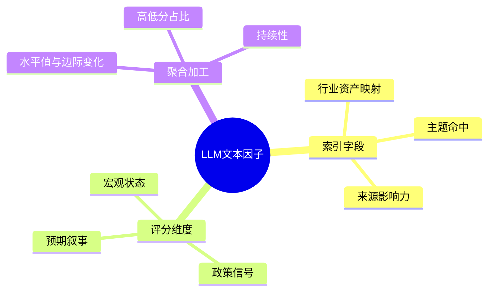

# LLM文本挖掘型投研综述方法论

> 用途：给定一个"LLM + 文本/非结构化数据"的量化投研课题方向 + 推荐参考来源（默认 `ZffQ-QuantReferencePrferred`），按本方法论可稳定产出一篇"快读型、归纳性强、可启发落地"的综述报告。
> 定位：本方法论**只管综述怎么写**，不管后续工程落盘、回测实现。落地另立项目计划。
> 版本：V260706 | 受众：资深量化研究员 / AI 量化研究员

---

## 一、方法论定位与适用场景

### 1.1 解决什么问题

普通综述的通病是"读了一堆研报，但写完仍不知道该提取哪些维度、维度之间如何分工、prompt 该约束什么"。本方法论要求综述**不止于梳理文献**，必须归纳到可启发的层次：

- 一张**维度/指标候选体系**（含定义、判别边界、因子逻辑、参考来源、优先级）
- 一版**提示词设计要点**（含输入粒度、输出字段、约束原则、可跑 prompt 骨架）
- 一组**方法启发**（流程、聚合、去重、衰减、验证思路等可迁移技能）

### 1.2 适用课题类型

适用于一切"用 LLM 对文本/非结构化数据做评分、分类、抽取、摘要，再转为量化信号"的课题，包括但不限于：

- 个股文本因子（机构调研、投资者互动、年报 MD&A、卖方研报、新闻、社交舆情）
- 宏观/政策文本指标（政策文件、新闻联播、央行报告、财经新闻、产业规划）
- 事件驱动信号（公告、研报发布、调研事件、政策出台）
- 跨资产/跨市场文本信号（商品、债券、汇率、海外资产）
- 另类文本（电商评论、招聘、专利、ESG 披露、电话会议转写）

### 1.3 输入与输出

- **输入**：① 课题方向（一句话 + 文本/数据来源说明）；② 推荐参考来源（默认 `ZffQ-QuantReferencePrferred`，可追加外部源）。
- **输出**：一篇纯综述 md，结构见第二章。**不涉及落盘路径、不涉及回测工程**。

---

## 二、综述报告的标准结构（模板）

一篇合格的 LLM 文本挖掘型综述应包含以下章节：

```text
# {课题名} 综述
> 用途 / 写法说明 / 参考资源

## 一、当前理解：{课题文本/数据特点 + 适合做什么样的因子/指标}
## 二、比较有用的研报（精读，按"启发维度类别 → 重要性"分组排序）
## 三、其他研报（弱相关，按"启发维度类别 → 重要性"分组排序，每篇一段话）
## 四、本项目可尝试的 LLM 评分维度 / 指标候选体系
   4.1 维度/指标候选表
   4.2 评分口径
   4.3 提示词设计要点（输入粒度 / 输出字段 / 约束原则 / 可跑 prompt 骨架）
   4.4 其他维度与参考来源（延伸/备用）
## 五、当前结论
```

### 2.1 两个"研报章节"的排序原则

- **精读章（二）** 和 **其他研报章（三）** 都按同一逻辑排序：先按**对本项目启发借鉴的维度类别**分组，组内再按**重要性/相关度**排序。
- 启发维度类别示例（按课题取舍，不固定）：维度设计、方法/流程、prompt 设计、聚合/因子构造、数据/样本、验证思路、策略接入、负面教训（什么做法效果不好）、工程技巧。
- 同一篇研报若在多个类别都有启发，归入最主要的一类，其余类别在条目内点出。

> 原则：综述不是"按时间或按来源平铺"，而是"按能启发本项目什么 → 多重要"来组织。

---

## 三、课题拆解与因子/指标形态判别

### 3.1 课题拆解（综述前必做）

动手检索前先把课题拆清楚，否则检索会发散。至少明确：

- **文本/数据来源**：哪些表、哪些字段、文本形态（长文/短问答/标题+摘要/转写稿/结构化段落）。
- **研究单元**：一篇文本对应一个什么对象（一家公司、一个行业、一个主题、一个时间窗口、一次事件）。
- **可获得口径**：文本真正可被研究者看到的时间点（公告披露日、发布日、回执日），区别于事件发生日。
- **目标输出**：要的是因子、指标、信号、标签，还是画像？

### 3.2 因子/指标形态光谱（归纳，不局限于两种）

不同课题的输出形态不同，先判别形态再设计维度，避免硬套。常见形态：

| 形态 | 颗粒度 | 典型课题 | 聚合方式 |
|------|--------|---------|---------|
| 个股截面因子 | 股票-日/周/月 | 调研/年报/研报文本选股 | 单篇评分 → 窗口聚合（均值/次数/最近值） |
| 聚合型宏观状态指数 | 行业/资产/主题-周/月 | 政策/新闻/央行文本 | 单篇评分 → 按索引标签 + 时间窗口聚合 |
| 事件信号 | 事件-窗口 | 公告/调研/政策出台事件 | 事件级判断 → 事件窗口收益检验 |
| 标签/分类层 | 对象-标签 | 主题识别、行业映射、热点命中 | 作为筛选层或分组层，不直接交易 |
| 叙事/趋势强度 | 主题-窗口 | 宏观叙事、市场叙事 | 按持续性聚合（连续出现才生效） |
| 风险/不确定性状态 | 全市场/分项-周/月 | EPU、信用压力、政策不确定性 | 状态变量，用于仓位/风控 |
| 跨资产映射信号 | 资产-窗口 | 商品/债券/汇率文本 | 按资产类别聚合，映射到对应标的 |

### 3.3 形态判别引导

- 文本是**围绕单一对象多次出现**还是**多源同窗口堆叠**？前者偏个股因子，后者偏聚合指数。
- 信号是**连续的**还是**事件型突发的**？连续用衰减/填充，事件用窗口收益检验。
- 输出是**方向性的**（有正负）还是**状态/压力性的**（单向累加）还是**识别性的**（0/1）？这决定评分口径（见 §六）。

> 这一节是综述"当前理解"章的写作依据：先告诉读者本课题文本适合做哪种形态，再说维度怎么设计。

---

## 四、资料检索与分级

### 4.1 检索原则：全面过筛 + 综述按相关度整合

- **检索阶段要全**：不能只挑 1-3 个团队。`§一` 卖方公众号全部过一遍，`§二` 资深量化/AI 公众号、`§三` 论文库/顶会/期刊中相关的也尽量覆盖；只要有参考价值的都纳入候选池。
- **综述阶段要精**：候选池里的内容，按**与本课题相关度 + 启发重要性**做整合归纳，不强求全部列进综述。相关度低但有一丁点启发的，归入"其他研报"章一段话。
- **外部来源**：Wind/慧博/搜狗微信/arXiv 等清单外来源，标注 `[补充来源]`。

### 4.2 与 `ZffQ-QuantReferencePrferred` 的衔接

| 检索对象 | 用 skill 的哪部分 | 检索要求 |
|---------|------------------|---------|
| 卖方金工团队 | `§一` 25 家 + `§六` 旗舰系列 | **全部过筛**，按深度方向挑有参考价值的 |
| 资深量化/AI 公众号 | `§二` | 相关的尽量覆盖 |
| 论文/顶会/期刊 | `§三` | 相关的尽量覆盖 |
| 趋势演进 | `§五` 年度热门主题 | 补时间脉络 |
| 课题路由 | `§四` 方向 → 资源路由表 | 起点，定方向 |

### 4.3 来源标注规范

- 清单内：`[卖方公众号]` / `[量化公众号]` / `[论文库]`；卖方用**真实公众号全称**（如「华泰证券金融工程」，非「华泰金工」）。
- 清单外：`[补充来源]`，例如 `[补充来源] 慧博：XX证券《XXX》2025-03`。
- 论文用 `§三` 标准来源名（arXiv / SSRN / NBER / 顶会 / 期刊全称）。

---

## 五、单篇精读方法（快读型综述风格）

### 5.1 每篇必备子节

```text
### {N}. {公众号/作者}：{研报标题}
原文链接 / 论文链接
#### {N}.1 原文做了什么、解决什么问题
   - 1-2 句背景
   - 按原文自己的流程展开：数据 → 标注/评分 → 指标构建 → 验证
#### {N}.2 对本项目的启发（多维度，按实际启发列，不固定分类）
   - 启发1：... ｜ 启发2：... ｜ ...
   - 适用性评价（一句话定性：很有用 / 有用 / 有限启发 / 仅背景引用）
```

### 5.2 图表文三结合

- **文**：正文压缩，只讲清"做了什么、怎么做的、得到什么、启发什么"。
- **表**：评分规则、样本覆盖、维度设计、实证结果、对比项等**必须单独列表**，不写进散文。
- **图**：原文关键图（prompt 截图、维度总览、结果图）可引用 `../assets/xxx.png`；自绘流程用 ASCII 代码块。
- **树状图/脑图**：对**特别复杂的思路或架构**（如多层模型架构、维度体系树、传导路径分支），用树状图或脑图呈现，比表格更能反映层级关系。

#### 树状图示例（ASCII）

```text
LLM 文本因子体系
├── 索引层（不判方向）
│   ├── 行业/资产映射
│   ├── 主题/热点命中
│   └── 来源/影响力
├── 评分层（判方向/强度）
│   ├── 宏观状态：景气度 / 通胀 / 货币条件 / 信用 / 库存 / 盈利 / 外部冲击
│   ├── 政策信号：取向 / 执行确定性 / 边际变化 / 发力点
│   └── 预期叙事：EPU / 叙事 / 预期分歧 / 风险偏好
└── 聚合层（窗口加工）
    ├── 水平值 / 边际变化
    ├── 高分占比 / 低分占比
    └── 来源加权 / 叙事持续性
```

#### 脑图示例（mermaid）



### 5.3 启发维度（多维度，不固定四分类）

启发条目按该篇实际能启发本项目的方面来写，常见维度（按需取用，可增可减）：

- **维度设计启发**：哪些评分/分类维度可迁移，如何改名、改边界。
- **方法/流程启发**：处理流程、聚合方式、去重、衰减、窗口设计。
- **prompt 设计启发**：证据约束、输出格式、遮蔽策略、言外之意识别。
- **聚合/因子构造启发**：从单篇评分到可用因子的加工方式。
- **数据/样本启发**：样本覆盖、口径处理、可获得日期对齐。
- **验证思路启发**：如何与基准/控制变量对照检验增量。
- **策略接入启发**：作为多头、空头排雷、负向调整、仓位校准还是风格切换。
- **负面教训**：哪些做法被原文证伪（如简单正负面情绪、正则关键词在原始 Q&A 上效果不佳）。
- **工程技巧**：批量调用、重试、JSON 校验、低温度等。

> 每篇启发条目**不超过该篇实际能给的**，不硬凑；适用性评价放最后一句。

### 5.4 精读章的分组排序

精读章内部按"启发维度类别 → 重要性"组织：

```text
二、比较有用的研报
  2.1 维度设计类启发（组内按重要性降序）
    (1) 最重要的一篇
    (2) 次重要的一篇
  2.2 方法/流程类启发
    ...
  2.3 prompt 设计类启发
  ...
```

> 一篇研报归入最主要启发类别；若跨类别，在条目内点出"另有 X 类启发"。

---

## 六、维度归纳与候选体系构造

### 6.1 维度来源标注

每个候选维度必须标注来源类型：

- **[原文直接]**：维度直接来自某原文的指标、标签或核心框架。
- **[归纳扩展]**：基于原文方法为本项目做的合并、改写或延伸。

### 6.2 维度合并去重

从多篇研报抽维度后，必须做合并去重，避免边界重叠。典型合并动作（举例，非穷举）：

```text
证据强度 + 回答具体度        → 证据具体度
经营动能 + 需求订单变化      → 经营景气度
未来展望 + 行业周期 + 催化   → 未来催化度
信息增量                    → 文本信息量（只看聚合文本自身密度）
信息重复度                  → 移出 LLM 维度，放到聚合预处理
```

> 判断原则：若两个维度的高低分样本文本无法区分，说明边界不清，需合并或重新定义。

### 6.3 评分口径分类（归纳，统一口径）

| 类型 | 分值 | 适用 |
|------|------|------|
| 方向性维度 | `-5~5` | 有正负向的（景气度、政策取向、风险偏好等） |
| 压力/强度类 | `0-5` | 单向累加的（信用压力、外部冲击、盈利压力等） |
| 识别类 | `0/1` | 是否命中（热点提及、主题识别） |
| 标签类 | 多标签 | 行业/资产映射、政策发力点、EPU 类型 |
| 叙事类 | 标签 + 强度 | 宏观叙事/趋势预期 |
| 连续值类 | `[-1,1]` 或 `0-100` | 语调、相似度等连续打分 |

### 6.4 索引字段 vs 评分维度（重点区分）

- **索引字段**（不判断方向强弱）：行业/资产映射、主题/热点命中、来源影响力。作用是"决定信号进入哪个池子/聚合到哪个颗粒度"。
- **评分维度**（判断方向强弱）：景气度、政策取向、EPU 等。在索引颗粒度上**共用同一套分数**。

> 原则：不要为每个行业/主题单独设计一套评分项；用"评分维度 × 索引字段"组合生成分项指标。

### 6.5 维度候选表必含字段

```text
| 模块 | 维度 | 评分方法 | 因子定义 | 因子逻辑 | 主要参考 | 优先级与用途 |
```

- **模块**：按课题分组（如 管理/经营/热点；或 宏观状态/政策信号/预期叙事/映射与权重）。
- **因子定义**：重点识别什么、负向关注什么（写清边界）。
- **因子逻辑**：正分/负分各意味着什么。
- **优先级与用途**：必做 / 优先 / 扩展 / 辅助；适合多头、排雷、风控还是分组。
- **主要参考**：回溯到精读章某篇。

---

## 七、提示词设计要点

### 7.1 通用原则（强制写入 prompt）

1. **先摘录原文依据，再评分**：evidence 必须来自原文，不能改写、补充、编造。
2. **未涉及 = 0 / 空**：维度无原文依据时给中性或空，不强行联想。
3. **各维度独立判断**：同次输出中不让其他维度影响当前维度分数。
4. **不硬套固定档位**：只说明正向/负向是什么，不要求机械匹配具体分数。
5. **不引入原文外信息**：必要时遮蔽对象身份（公司名/代码/日期），避免模型凭印象打分。
6. **强约束结构化输出**：固定字段、固定顺序（JSON 或固定 schema），便于批量解析。
7. **识别"言外之意"**：官方/审慎/偏乐观表述不能自动视为强正面，需实质证据才提分。
8. **低温度**：`temperature=0` 或 `0.1`，保证可复现。

### 7.2 输入粒度与日期口径（必须明确）

| 数据源类型 | 原始最小单位 | 模型输入单位 | 事件日期 | 可获得日期 |
|-----------|-------------|-------------|---------|-----------|
| 个股问答/互动 | 一行 = 一条 Q&A | 同对象 + 同公告日的多条 Q&A | 发生日 | 披露日 |
| 政策/新闻/央行 | 一篇 = 一条文本 | 单篇 → 按索引标签拆行 | 发布日 | 可获得日 |
| 长文（年报/纪要） | 一篇 = 一段长文 | 按章节切分后输入 | 报告期 | 发布日 |

> 关键约束：**回测只能用可获得日期**，事件日期仅作追溯，不传给模型。

### 7.3 输出字段（通用最小集）

```text
索引字段（如 industry_asset_tags / dimension）
score           数值（按口径）
evidence        原文依据（必来自原文）
reason          一句话打分原因
confidence      evidence 支撑 score 的可信度，0~1
```

### 7.4 可跑 prompt 骨架（每篇综述给一版）

综述应给出一版可跑的 prompt 骨架，包含：输入文本占位、总规则、注意事项、维度定义清单、输出格式模板。具体维度随课题替换。

---

## 八、写作风格规范

### 8.1 快读型综述风格

- 正文压缩，**评分规则、样本覆盖、策略流程、实证结果单独列表**。
- 有用研报保留"原文做了什么"+"对本项目的启发"两部分。
- 每篇按**原文自己的研究流程**展开，而不是按统一模板硬套。

### 8.2 图表文三结合（再次强调）

- 能表不散：对比、规则、结果用表。
- 能图不表：复杂架构、层级关系、传导路径用树状图/脑图。
- 文起串接：正文只串接"做了什么→启发什么"，细节留给图表。

### 8.3 公式与代码

- 标签、评分、指数定义写清数学定义或引用函数名。
- 流程图优先 ASCII 代码块（便于 Git diff）；复杂架构可用 mermaid。

### 8.4 文首元信息

```text
# {课题名} 综述
> 用途：...
> 写法：采用"快读型综述风格"，图表文三结合...
> 参考资源：ZffQ-QuantReferencePrferred V260706
```

### 8.5 引用规范

- 卖方用真实公众号全称；论文用 `§三` 标准来源名；清单外标注 `[补充来源]`。
- 每条引用附原文链接或论文链接。

---

## 九、执行流程（Agent 操作步骤）

```text
Step 1  课题拆解 + 因子/指标形态判别
        - 明确文本来源、研究单元、可获得口径、目标输出
        - 判别因子/指标形态（见 §三光谱，不局限两种）
        - 在 reference.md §四 路由表定位方向行

Step 2  资料检索（全面过筛）
        - §一 卖方公众号：25 家全部过一遍，按深度方向挑有参考价值的
        - §二 资深量化/AI 公众号：相关的尽量覆盖
        - §三 论文库/顶会/期刊：相关的尽量覆盖
        - §五 年度主题 + §六 旗舰系列：补趋势与对标
        - 外部源标注 [补充来源]
        - 形成候选池

Step 3  选定精读篇目 + 精读归纳
        - 从候选池按"相关度 + 启发重要性"选定精读篇目
        - 每篇按"原文流程 + 多维度启发 + 适用性评价"展开
        - 图表文三结合：复杂架构用树状图/脑图
        - 精读章按"启发维度类别 → 重要性"分组排序

Step 4  维度归纳与候选体系
        - 从精读篇抽维度，标注 [原文直接] / [归纳扩展]
        - 合并去重，统一评分口径
        - 区分索引字段 vs 评分维度
        - 输出维度候选表（含优先级）

Step 5  提示词设计要点
        - 定义输入粒度与日期口径
        - 设计输出字段
        - 写出可跑 prompt 骨架
        - 写入 8 条通用原则

Step 6  自检（见第十章清单）
```

> 说明：本流程**不包含落盘与回测工程**。综述只负责"梳理 + 归纳 + 启发落地设计"，具体落地另立项目计划。

---

## 十、自检清单

```text
结构完整
- [ ] 文首有 用途 / 写法 / 参考资源 三行元信息
- [ ] 一、当前理解（课题文本特点 + 因子/指标形态定位）
- [ ] 二、精读章：按"启发维度类别 → 重要性"分组排序
- [ ] 三、其他研报章：按"启发维度类别 → 重要性"分组排序，每篇一段话
- [ ] 四、维度候选表 + 评分口径 + 提示词设计要点 + 其他维度与参考来源
- [ ] 五、当前结论

检索覆盖
- [ ] §一 卖方公众号已全部过筛（非只挑 1-3 个）
- [ ] §二/§三 相关公众号与论文已尽量覆盖
- [ ] 清单外来源标注 [补充来源]

精读质量
- [ ] 每篇含"原文做了什么 + 多维度启发 + 适用性评价"
- [ ] 启发按实际启发列，不硬凑四分类
- [ ] 评分规则/样本/流程/结果均单独列表
- [ ] 复杂架构用了树状图/脑图

维度归纳
- [ ] 每个候选维度标注 [原文直接] / [归纳扩展]
- [ ] 维度已合并去重，边界清晰
- [ ] 评分口径统一
- [ ] 索引字段与评分维度已区分
- [ ] 维度候选表含"主要参考"可回溯

提示词
- [ ] 含 8 条通用原则
- [ ] 输入粒度与日期口径已明确
- [ ] 给出一版可跑 prompt 骨架

风格
- [ ] 图表文三结合
- [ ] 卖方用真实公众号全称
- [ ] 论文用 §三 标准来源名
- [ ] 每条引用有链接
```

---

## 附录：范本对照

| 范本 | 课题 | 因子/指标形态 | 索引颗粒度 | 维度模块 | 评分口径 |
|------|------|--------------|-----------|---------|---------|
| 机构调研文本LLM评分维度研报综述.md | 机构调研 Q&A + LLM 多维评分 | 个股截面因子 | 股票-可获得日期 | 管理/经营/热点 | S1 `-5~5` / S0 `0/1` |
| 政策宏观文本LLM评分维度研报综述.pdf | 政策/新闻/央行 + LLM 多维评分 | 聚合型宏观状态指数 | industry_asset_tags | 宏观状态/政策信号/预期叙事/映射与权重 | `-5~5` / `0-5` / `0/1` / 多标签 |

> 两份范本仅作对照示例；本方法论适用于一切 LLM 文本挖掘型课题，不局限于这两种形态。
