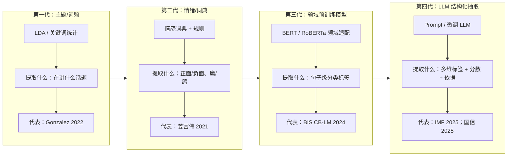
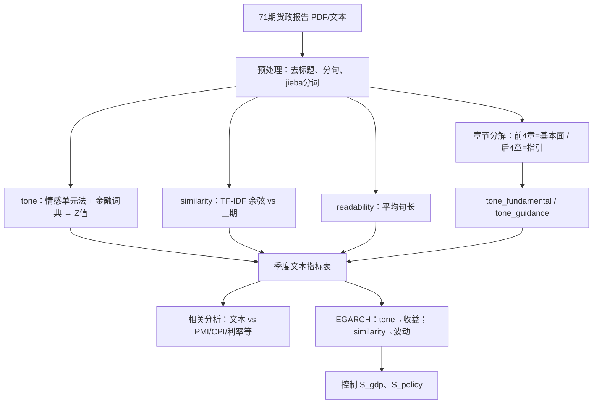
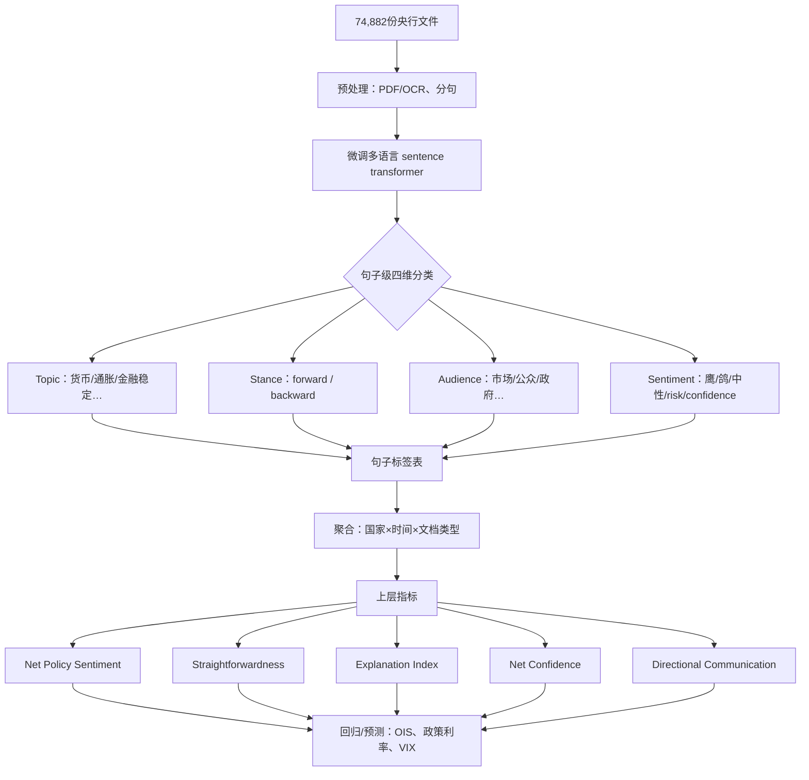
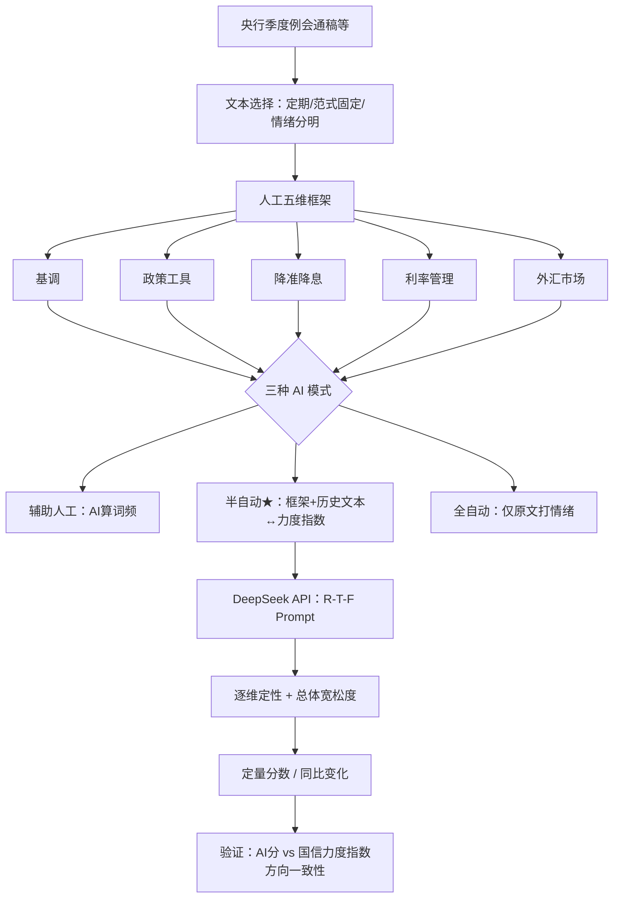
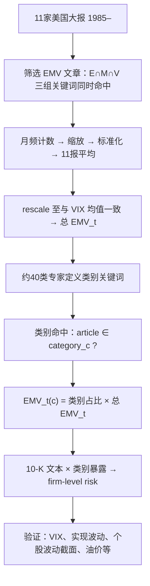
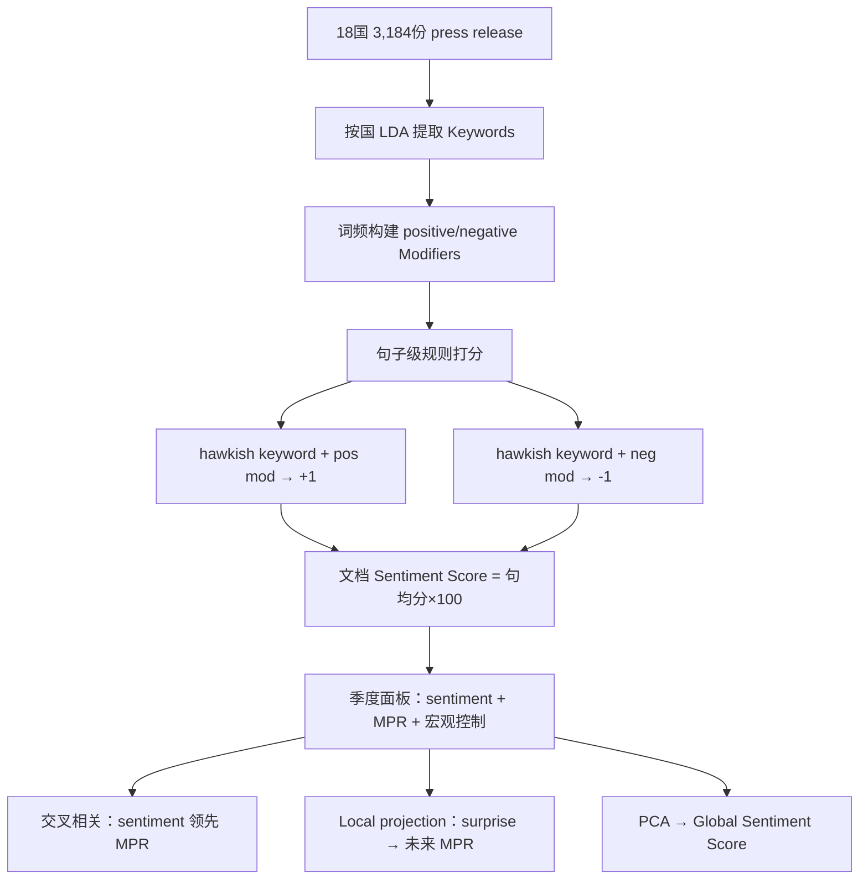
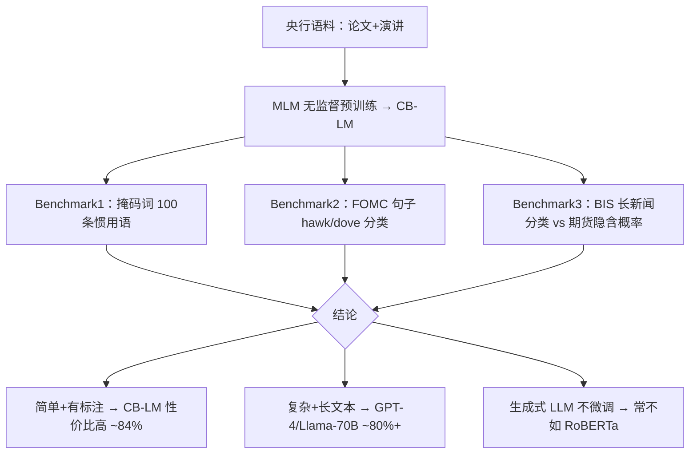
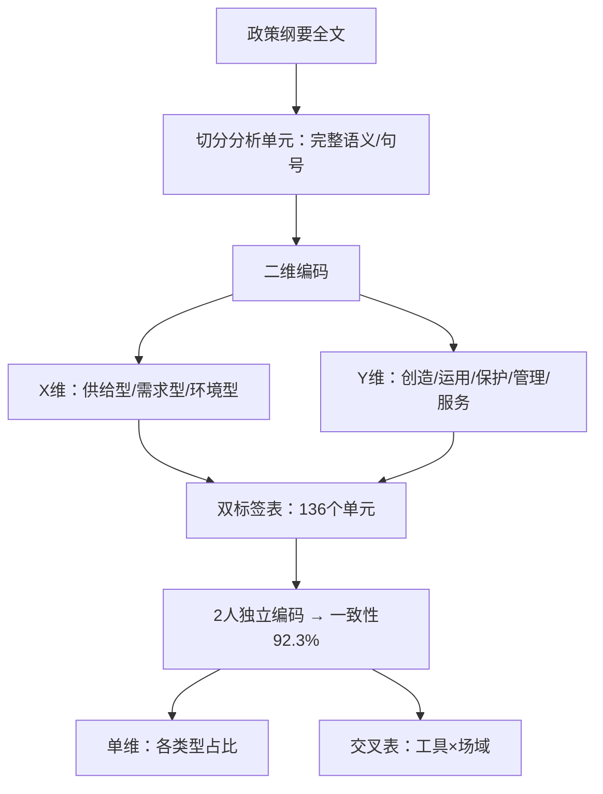

# 金融市场政策文本 LLM 结构化抽取与股市因子 文献综述

> 用途：为本课题「用 LLM 对金融市场相关政策文本做结构化抽取，找到其中的维度，检验其能否解释或预测股票市场反应」提供文献精读与方法论参照。
> 文献来源：`文献_raw.md` [001]–[007]。

---

## 一、当前理解

### 1.1 课题目标

**用 LLM 对金融市场相关政策文本做结构化抽取，从中识别并量化关键信息维度，检验这些维度能否解释或预测股票市场反应。**

「结构化抽取」指：不是整篇打一个情绪分，而是按预先设计或文献支持的维度（如政策取向、时态、工具类型、行业指向、新信息强度等）对文本单元打标签或打分，再聚合为可检验的因子候选。

「相关政策文本」在本课题中主要包括：央行沟通（货政报告、例会通稿）、资本市场制度政策（降手续费、债市规则等）、行业/产业政策、长期规划（两会、五年规划）等。

**项目定位（Review03 / Review05）：** 总目标是从政策文本到可验证的交易/监控信号。Review05 将工作拆为 **8 个子课题**——直接类（①全A及风格、②行业产业）、间接类·宏观中间变量（③增长、④通胀、⑤货币流动性、⑥宏观流动性）、独立跟进类（⑦纲领性规划、⑧宏观叙事）；综述完成后统一建设 **LLM 文本分类打标签层**，再分路由进入各子课题做维度评分与聚合。Review03 强调「去伪存真」、五类政策优先级、文本五维度（对比性/重复性/语气强度/阶段出处/禁止性指令），以及「工具—发力点—目标」拆解传导路径。

---

### 1.2 文本挖掘简史：从主题到 LLM

金融/政策文本的信息提取，大致经历了四代方法。每一代回答的问题不同，提取的「维度」也不同。



| 阶段      | 典型方法                   | 主要提取维度             | 局限                     |
| --------- | -------------------------- | ------------------------ | ------------------------ |
| 主题挖掘  | LDA、词频                  | 话题、关键词             | 难表达立场、力度、时态   |
| 情绪/词典 | LM 词典、keyword+modifier  | 鹰鸽、正负面、相似度     | 语境依赖强；维度单一     |
| 领域 BERT | CB-LM 微调分类             | 固定标签（hawk/dove 等） | 需标注；开放维度需改模型 |
| LLM       | Prompt 打分 / 微调多维分类 | 多维度 + evidence        | 稳定性、幻觉需控制       |

**对本课题的启示：** 政策文本因子不应停留在「一个情绪分」，而应沿第四代思路做**多维结构化抽取**，同时借鉴第二代（相似度、章节分解）和第一代（主题/行业分类）的聚合逻辑。

---

## 二、文献精读

> 以下按单篇组织，每篇独立成节。结构：原文目标 → 工作流程 → 点评 → **子课题赋能**（对照 Review03/Review05 八个子课题编号①–⑧）。

**子课题编号速查：** ①全A及风格 | ②行业产业 | ③增长 | ④通胀 | ⑤货币流动性 | ⑥宏观流动性 | ⑦纲领性规划 | ⑧宏观叙事

### 2.1 姜富伟、胡逸驰、黄楠 (2021). 央行货币政策报告文本信息、宏观经济与股票市场

**链接：** [《金融研究》摘要](http://www.jryj.org.cn/CN/abstract/abstract897.shtml) | 本地 PDF：`文献综述/央行货币政策报告文本信息、宏观经济与股票市场.pdf`

#### 2.1.1 原文做了什么

**想解决的问题：** 央行《货币政策执行报告》里的文字信息，能否解释宏观经济走势和股票市场反应？哪些文本成分真正「进了股市定价」？

**研究目标：** 从报告文本中提取可量化的多维指标，检验其与宏观变量、股市收益和波动的关系；并分解「历史回顾」与「政策指引」两部分，看哪一部分驱动市场。

**数据：** 2001Q1–2018Q3 共 71 期报告；股市为上证综指等四指数日度数据（2005.10–2018.12）。

#### 2.1.2 工作流程



**数据结构（精简）：**

```text
【文档】| quarter | full_text |
【指标】| quarter | tone_z | similarity | readability |
【分解】| quarter | tone_fundamental_z | tone_guidance_z |
【验证】EGARCH 均值方程 ← tone；方差方程 ← similarity
```

**例子：** 若本期报告措辞与上期高度相似（similarity↑），方差方程中波动显著下降——市场将其解读为「少有新信息、预期更稳定」。若 tone_guidance 改善（更偏宽松指引），发布后指数收益显著为正；而 tone_fundamental 对股市不显著，因为 GDP、CPI 等已在数据发布时被市场消化。

#### 2.1.3 点评

| 价值点                 | 说明                                                                                |
| ---------------------- | ----------------------------------------------------------------------------------- |
| **A 股验证标杆** | 国内少有的「央行文本 → 股市 EGARCH」peer-reviewed 文献，是本课题验证规格的直接参照 |
| **指引 vs 回顾** | 长文必须分章节再打分；驱动股市的是「前瞻指引」，不是「历史回顾」                    |
| **多维而非单分** | tone + similarity + readability 三个维度各有分工（收益 / 波动 / 不显著）            |
| **方法局限**     | 词典法，非 LLM；但对本课题的**维度设计**和**验证框架**仍是最重要基准    |

#### 2.1.4 子课题赋能

| 子课题                       | 赋能方式                                                                                                                                                                                                            |
| ---------------------------- | ------------------------------------------------------------------------------------------------------------------------------------------------------------------------------------------------------------------- |
| **⑤ 货币流动性类**    | **tone_guidance**（仅后四章）→ 货币条件指数的文本侧输入；**policy_margin** 可对标 Review03「对比性」——相对上期例会/报告口径变化；验证规格（EGARCH + 控制 S_policy）可直接用于⑤的指数→风格/仓位映射 |
| **① 全A市场及风格类** | tone→**均值方程**（发布后收益）提供「央行沟通→全A贝塔」的学术验证范式；similarity→**方差方程**可迁移为仓位**温度/波动预警**因子（Review03 监控因子定位）                                       |
| **⑧ 宏观叙事类**      | **similarity** 对应 Review03 五维度中的**对比性/新信息强度**；全文 tone 与 guidance tone 分离，避免把「回顾基本面」误当叙事冲击                                                                         |
| **LLM 分类打标签层**   | **章节切分规则**（回顾 vs 指引）可写入路由后预处理：货政报告/例会通稿进入⑤时，须先分段再送 LLM 评分                                                                                                          |

**Review03 对照：** 央行会议纪要边际变化（§7.2）≈ 姜富伟 guidance 分解；文本对比识别口径变化（§3.1 对比性）≈ similarity + 逐期对比 Prompt（国信路线）。

---

### 2.2 Silva, Moriya & Veyrune (2025). IMF WP/25/109 — From Text to Quantified Insights

**链接：** [PDF](https://www.imf.org/-/media/files/publications/wp/2025/english/wpiea2025109-print-pdf.pdf) | [IMF 页面](https://www.imf.org/en/publications/wp/issues/2025/06/06/from-text-to-quantified-insights-a-large-scale-llm-analysis-of-central-bank-communication-567522)

#### 2.2.1 原文做了什么

**想解决的问题：** 如何把全球央行沟通文本系统性地变成可量化、可比较的宏观指标？央行对不同受众、不同时态、不同主题分别说了什么？

**研究目标：** 提出句子级**四维分类框架**，用微调 LLM 对 169 家央行、约 2,100 万句做标注，聚合为宏观文本指数，并检验对利率、波动率的预测力。

#### 2.2.2 工作流程



**数据结构（精简）：**

```text
【句子】| sent_id | doc_id | text | topic | stance | audience | sentiment |
【聚合】| country | date | net_sentiment_fwd | net_sentiment_bwd | straightforwardness | … |
【验证】前瞻 sentiment → 未来利率；前瞻 risk 沟通 → 未来波动
```

**例子：** 同一句「通胀压力仍存，将继续收紧货币政策」→ Topic=通胀, Stance=forward, Sentiment=hawkish。聚合时仅 **forward** 成分的 hawkish 占比进入「预测未来利率」的回归；**backward** 成分主要解释当期状况。Sentiment 不限于鹰鸽，还可标为 risk-highlighting（强调下行风险）或 confidence-building（强调经济韧性）。

#### 2.2.3 点评

| 价值点                              | 说明                                                                                  |
| ----------------------------------- | ------------------------------------------------------------------------------------- |
| **最系统的 LLM 维度框架**     | Topic / Stance / Audience / Sentiment（含 risk/confidence）可直接作为 Prompt 维度候选 |
| **句子→聚合→指标 pipeline** | 中间表结构清晰，是本课题 LLM 抽取层的设计范本                                         |
| **前瞻/回顾分解**             | 与姜富伟「指引 vs 基本面」结论一致，跨文献互相印证                                    |
| **验证对象**                  | 主要验证利率与波动，**A 股直接验证少**——本课题可承接其维度、改验证市场        |

#### 2.2.4 子课题赋能

| 子课题                     | 赋能方式                                                                                                                                                                                        |
| -------------------------- | ----------------------------------------------------------------------------------------------------------------------------------------------------------------------------------------------- |
| **⑤ 货币流动性类**  | **Topic×Stance×Sentiment** 句子级标签 → 聚合为 Net Policy Sentiment（可拆 forward/backward）→ **货币条件指数**；**Directional Communication** 捕捉降准降息/结构性工具信号 |
| **④ 通胀类**        | Topic=通胀/价格的句子占比 + hawk-dove →**通胀压力指数**文本分量；**risk-highlighting** 前瞻成分 → 输入性通胀/供给约束叙事                                                         |
| **⑥ 宏观流动性类**  | **Audience** 维度（对公众 confidence / 对政府 risk）→ 广义流动性与**风险偏好**评估；与 Review03 居民财富、risk-on/off 叙事衔接                                                     |
| **⑧ 宏观叙事类**    | **Net Confidence / risk-highlighting** → EPU、政策情绪分项；前瞻 risk 沟通 → **波动率预警**（原文验证 VIX）                                                                       |
| **① 全A及风格类**   | 前瞻 sentiment → 利率/风险溢价通道，间接支撑**风格切换**（成长/久期）假设；需在 A 股复现 forward-only 聚合                                                                               |
| **LLM 分类打标签层** | 四维标签可作为**路由后各子课题的共享评分 schema 母版**；Topic 辅助子课题路由（货币→⑤，通胀→④，金融稳定→①/⑧）                                                                       |

**Review03 对照：** §3.4 政策阶段与出处 ↔ Stance(forward/backward)；§5.4 EPU 构建 ↔ risk 沟通 + Topic 政策类；§11.1 第二层解析器 ↔ 句子级多维 LLM 抽取。

---

### 2.3 田地、王开 (2025). 国信证券 — AI 赋能资产配置（七）：DeepSeek 理解货币政策取向

**链接：** 本地 PDF：`文献综述/20250317-国信证券：AI赋能资产配置(七)：乘风DEEPSEEK理解货币政策取向.pdf`

#### 2.3.1 原文做了什么

**想解决的问题：** 如何用 AI 从央行货币政策委员会季度例会等短文本中，稳定、可重复地提取「更宽松还是更收紧」，并量化成可与宏观指数对照的分数？

**研究目标：** 建立「人工框架 + LLM 解读 + 历史校准」的实务 pipeline，输出政策宽松度定性/定量判断，并与「国信货币政策力度指数」对照验证。

**性质：** 券商研报，非 peer-reviewed；偏落地演示，回归规格不如学术论文严谨。

#### 2.3.2 工作流程



**数据结构（精简）：**

```text
【原文】| period | doc_type | full_text |
【五维】| period | dimension | key_quotes | manual_label |
【AI输出】| period_pair | dimension | AI_qualitative | evidence |
【定量】| period | AI_score | 国信力度指数 |
【半自动】F(P,x,θ)：P=当期文本，x=历史对照，θ=Prompt/温度
```

**例子：** 对比 2024Q4 vs Q3 例会，Prompt 要求引用原文判断「基调」维度——若 Q4 出现「适度宽松、加大调控力度、择机降准降息」而 Q3 表述更中性，则 AI 输出「Q4 更宽松」，并摘录 evidence；半自动模式下，历史期「文本—力度指数」对照作为 few-shot，使新一期分数与扩散指数方向趋同。

#### 2.3.3 点评

| 价值点                           | 说明                                                               |
| -------------------------------- | ------------------------------------------------------------------ |
| **最接近本课题的国内实践** | Prompt + 结构化框架 + 宏观指数校准，可直接迁移                     |
| **半自动 > 全自动**        | 只给原文让 AI 打情绪分不稳定；需投喂分析师框架与历史对照           |
| **五维拆解**               | 基调/工具/降准降息/利率/外汇——央行短文本的可操作维度清单         |
| **负面教训**               | FinBERT 对央行语境效果差；研报缺严格股市回归，不能替代姜富伟式验证 |

#### 2.3.4 子课题赋能

| 子课题                          | 赋能方式                                                                                                                                                                      |
| ------------------------------- | ----------------------------------------------------------------------------------------------------------------------------------------------------------------------------- |
| **⑤ 货币流动性类**       | **五维框架**（基调/工具/降准降息/利率/外汇）≈ ⑤综述可直接采用的 Prompt 维度清单；**半自动模式**（历史文本↔力度指数）→ 货币条件指数的**校准与 few-shot** |
| **③ 增长类 / ④ 通胀类** | 五维中的「基调+工具」文本信号，可与卖方宏观一致预期（Review03 §7.1）**叠加**而非替代——文本抓边际措辞，卖方抓总量预期                                                 |
| **⑧ 宏观叙事类**         | **逐期对比任务**（Q4 vs Q3 更宽松？）→ Review03 **对比性**维度的可操作 Prompt；evidence 引用 → 可审计叙事强度                                                   |
| **LLM 分类打标签层**      | **文本选择四要求**（定期/范式固定/情绪分明/有影响力）→ 有效性过滤规则；R-T-F Prompt 范式 → 分类层与各子课题评分层的模板起点                                           |

**Review03 对照：** §5.1 态度 vs 路径 ↔ 五维中「基调(态度)」与「工具/降准降息(路径)」拆分；§11.1 分域建模 ↔ ⑤独立 Prompt、不与②共用模板（Review05 §6.3 约定一致）。

---

### 2.4 Baker, Bloom, Davis & Kost (2019/2025). Policy News and Stock Market Volatility (NBER w25720)

**链接：** [NBER w25720](https://www.nber.org/papers/w25720) | [PDF](https://www.nber.org/system/files/working_papers/w25720/w25720.pdf) | [EMV 数据](https://www.policyuncertainty.com/EMV_monthly.html)

#### 2.4.1 原文做了什么

**想解决的问题：** 哪些新闻议题在驱动股市波动？政策类新闻占多大比重？能否把「波动相关文本」分解为可检验的分项指数，并映射到公司/行业层面？

**研究目标：** 用美国 11 家大报构建 **EMV（Equity Market Volatility）** 追踪器（与 VIX 高度相关），再拆成约 40 个类别（含货币、财政、监管等政策），并结合 10-K 得到公司层面风险暴露，解释个股波动横截面。

#### 2.4.2 工作流程



**数据结构（精简）：**

```text
【文章池】| article_id | date | hit_E & hit_M & hit_V |
【总指数】| month | EMV_t |
【分项】| month | category | EMV_t(c) |
【公司】| firm | month | exposure_c | → 解释 realized volatility
```

**例子：** 某月 EMV 文章中有 30% 讨论货币政策、25% 讨论监管。则 `EMV_t(货币政策) = 0.30 × EMV_t`。若某公司在 10-K 中大量提及「利率」「监管」等风险因子，则其对该类 EMV 暴露更高，个股实现波动横截面更大（控制 firm/time FE 仍显著）。

**与 EPU 的区别：** EPU 用「经济×政策×不确定」词频，无天然市场基准；EMV 以 VIX 为锚，词表算法优化拟合波动，样本外相关约 0.8。

#### 2.4.3 点评

| 价值点                           | 说明                                                                                     |
| -------------------------------- | ---------------------------------------------------------------------------------------- |
| **先圈文本池，再分类**     | 不是全库打分，而是先定义「与股市波动相关的文章」，再在池内分解——对本课题文本筛选有启发 |
| **政策分项占比 × 总强度** | 分项指数构造公式简洁，可迁移为「某类政策文本占比 × 政策强度」                           |
| **行业/公司映射**          | 10-K 暴露 → A 股可延伸为申万行业暴露、风格暴露                                          |
| **非 LLM**                 | 关键词法透明可复现；LLM 可用于升级类别识别，但需对照其样本外逻辑                         |

#### 2.4.4 子课题赋能

| 子课题                       | 赋能方式                                                                                                                                      |
| ---------------------------- | --------------------------------------------------------------------------------------------------------------------------------------------- |
| **① 全A市场及风格类** | **先筛 EMV 文本池**（E∩M∩V）→ 等价于「只处理与股市波动相关的政策/新闻」；总 EMV → **仓位温度、波动预警**（Review03 监控因子） |
| **② 行业产业类**      | **~40 类议题分解**（含产业、监管、大宗）→ 行业标签体系参考；**EMV_t(c)=占比×总强度** → 申万行业景气分的聚合公式                |
| **⑧ 宏观叙事类**      | 政策类 EMV 占比（货币~30%、监管~25%、财政~35%）→ **EPU 分项**构建思路；与 Review03 §5.4「经济+政策+不确定」召回一致                  |
| **④ 通胀 / ⑤ 货币**  | 类别 EMV（利率、通胀、大宗商品）→ 分别路由至④⑤的**主题强度**子指标                                                                   |
| **LLM 分类打标签层**   | **专家驱动类别清单**（非算法聚类）→ 子课题路由标签的设计方法；10-K 暴露 → ②「政策→行业暴露→收益/波动」验证延伸                     |

**Review03 对照：** §2.1 资本市场类 + §2.4 垂直监管 → EMV 中监管/制度类占比；§10.1 多资产映射 → 分项 EMV × 行业/风格暴露。

---

### 2.5 Gonzalez & Tadle (2022). BIS WP/1023 — Monetary Policy Press Releases: An International Comparison

**链接：** [BIS WP/1023](https://www.bis.org/publ/work1023.htm)

#### 2.5.1 原文做了什么

**想解决的问题：** 18 国央行货币政策 press release 的文字情绪，能否预测未来政策利率（MPR）变化？危机期间各国情绪是否共振？

**研究目标：** 用 **LDA + 自定义词典**（非 LLM）构建连续 Sentiment Score（-100~100），做跨国比较与宏观预测；并提取 sentiment 的「意外成分」再检验因果。

#### 2.5.2 工作流程



**数据结构（精简）：**

```text
【句子】| sent_id | keywords | pos_mod | neg_mod | score ∈ {-1,0,+1} |
【文档】| country | date | sentiment_score |
【面板】| country | quarter | sentiment_q | MPR | inflation | … |
【surprise】sentiment 对宏观回归残差 → 再预测 MPR
```

**例子：** 句子「通胀上行风险加大，需**收紧**货币政策」→ 命中 hawkish keyword「通胀/收紧」，positive modifier 多 → score=+1。文档级均分×100 得 Sentiment Score。若该分数高于宏观模型预测值（surprise 为正），local projection 显示未来 1–2 季度 MPR 更可能上调。

#### 2.5.3 点评

| 价值点                                | 说明                                                                      |
| ------------------------------------- | ------------------------------------------------------------------------- |
| **传统方法里最完整的 pipeline** | 文本→指数→surprise→预测，链条清晰                                      |
| **keyword + modifier 双条件**   | 比单纯数词频更懂语境；可写进 LLM Prompt（「须同时识别主题词与语气修饰」） |
| **surprise 提取**               | 文本因子需证明超越已知宏观的增量——本课题应借鉴                          |
| **技术可升级**                  | 规则可被 LLM 替代，但聚合与验证逻辑不过时                                 |

#### 2.5.4 子课题赋能

| 子课题                     | 赋能方式                                                                                                                                                           |
| -------------------------- | ------------------------------------------------------------------------------------------------------------------------------------------------------------------ |
| **⑤ 货币流动性类**  | **Sentiment Score → MPR** 的完整链条 → ⑤「文本指数→货币条件→风格/仓位」的验证模板；**surprise 残差** → 避免文本重复已知宏观（Review03 去伪存真） |
| **④ 通胀类**        | LDA**Keywords** 按国提取通胀/价格主题 → ④主题强度指数；keyword+modifier 双条件 → LLM Prompt 须「主题词+语气修饰」联合判断                                 |
| **⑧ 宏观叙事类**    | **Global Sentiment Score（PCA）** → 跨国/跨源政策情绪共振；危机期共变动↑ → 系统性 risk-off 叙事监测                                                       |
| **③ 增长类**        | 增长相关 keyword 句子 → 可并入③景气文本分量（与行业产业政策文本交叉）                                                                                            |
| **LLM 分类打标签层** | 句子级 ±1 打分 → 文档聚合 → 面板回归的**三层中间表**结构，可直接作为各子课题 output schema                                                                |

**Review03 对照：** §3.1 对比性 ↔ 逐期 Sentiment 变化；§7.1 不自主建高频指标、用 surprise 过滤后叠加卖方预期 ↔ Gonzalez surprise + local projection 逻辑。

---

### 2.6 Gambacorta et al. (2024). BIS WP/1215 — CB-LMs: Language Models for Central Banking

**链接：** [PDF](https://www.bis.org/publ/work1215.pdf) | [BIS 页面](https://www.bis.org/publ/work1215.htm)

#### 2.6.1 原文做了什么

**想解决的问题：** 央行任务上，应该用「领域微调的小 encoder」还是「通用大生成模型」？不同任务难度下如何选型？

**研究目标：** 用央行语料重训练 BERT/RoBERTa 得到 **CB-LMs**，设计三档 benchmark 系统比较 CB-LM vs ChatGPT/Llama 在央行文本上的表现。

**性质：** **模型选型论文**，不做宏观/股市实证，不定义「该提取哪些维度」。

#### 2.6.2 工作流程



**数据结构（精简）：**

```text
【预训练】| doc | tokens | → MLM loss |
【FOMC句】| sentence | label ∈ {hawk,dove,neutral} | → accuracy |
【长新闻】| news_text | label | vs Fed Funds Futures 变化 |
```

**例子：** FOMC 句「劳动力市场仍然**紧张**，通胀**高于**目标」→ 专家标 hawkish；CB-LM（RoBERTa+Paper+Speech）测试集约 84% 准确率；同任务不微调的 ChatGPT-3.5 约 50–71%，不如基础 RoBERTa。

#### 2.6.3 点评

| 价值点                       | 说明                                                                            |
| ---------------------------- | ------------------------------------------------------------------------------- |
| **回答「用什么模型」** | 与 IMF（打什么标签）、国信（怎么用 Prompt）互补                                 |
| **任务分层**           | 掩码词 → 句分类 → 长文分类；本课题若做固定标签可考虑微调 sentence transformer |
| **Prompt 路线仍成立**  | 开放多维打分、少标注时，大模型 API + 结构化 Prompt（国信/IMF 路线）更合适       |
| **非维度文献**         | 不直接提供因子定义，但支持「央行短文本上通用 FinBERT 易失效」的判断             |

#### 2.6.4 子课题赋能

| 子课题                              | 赋能方式                                                                                                                 |
| ----------------------------------- | ------------------------------------------------------------------------------------------------------------------------ |
| **LLM 分类打标签层**          | **任务分层 benchmark** → 分类层（简单多标签）用 API LLM；若后续积累标注，可对 hawk/dove 等固定标签微调 CB-LM      |
| **⑤ 货币流动性类**           | FOMC 句级 hawk/dove 分类结果 → ⑤文本侧「立场标签」的**模型精度下限**参照；长新闻任务 → 货政报告全文分类选型依据 |
| **① / ② / ③–⑥ 各子课题** | 不共用 Prompt 时，各子课题若走「微调小模型」路线，本文给出**何时不必上大模型**的成本—精度权衡                     |
| **⑧ 宏观叙事类**             | 间接支持：通用 FinBERT 在央行/domain 文本上失效 → ⑧情绪提取须用 domain Prompt 或 CB-LM，不可照搬股吧情感模型           |

**Review05 对照：** §4 LLM 分类打标签 + §6.3「各子课题不共用 prompt」→ 分类层可统一用 LLM API，维度评分层按子课题选 CB-LM 或 Prompt。

---

### 2.7 蒋欣 (2022). 政策工具视角下《知识产权强国建设纲要》文本分析

**链接：** [DOI](https://doi.org/10.12677/ass.2022.111023) | 本地 PDF：`文献综述/ass20220100000_51470297.pdf`

#### 2.7.1 原文做了什么

**想解决的问题：** 一份国家级政策纲要中，政策工具如何分布？不同「作用场域」上分别用了哪些工具？

**研究目标：** 对《知识产权强国建设纲要》做**二维内容分析**——X 维=政策工具类型，Y 维=政策作用场域——逐条人工编码，统计占比与交叉分布。

**与金融/股市关系：** **无股市验证**；文本对象为知识产权政策，非货币政策。价值在**编码范式**，不在实证结论。

#### 2.7.2 工作流程



**数据结构（精简）：**

```text
【单元】| unit_id | content | code |
【双标签】| unit_id | tool_type | policy_field |
【交叉表】| tool ↓ / field → | 创造 | 运用 | 保护 | … |
```

**例子：** 「严格保护知识产权，完善法律法规体系」→ 单元编码：工具=环境型-法律法规，场域=保护。交叉表显示「保护」场域过度依赖「环境型-策略性措施」（25/52），作者据此讨论政策结构失衡。

#### 2.7.3 点评

| 价值点                   | 说明                                                                           |
| ------------------------ | ------------------------------------------------------------------------------ |
| **先框架、后编码** | 不让模型直接打一个总分；每个单元有可审计双标签                                 |
| **交叉表聚合**     | 产业政策文本可看「什么工具打在哪个行业/领域」                                  |
| **人工一致性检验** | 迁移为 LLM 标注 + 人工抽检 Kappa                                               |
| **局限**           | 单文档、无时间序列、无市场；仅适合本课题中**产业政策子类**的维度设计参考 |

#### 2.7.4 子课题赋能

| 子课题                     | 赋能方式                                                                                                                                         |
| -------------------------- | ------------------------------------------------------------------------------------------------------------------------------------------------ |
| **② 行业产业类**    | **工具类型 × 作用场域** 二维编码 → 直接对标 Review03 **「工具—发力点—目标」**；交叉表 → 「什么工具打在哪个申万行业/产业链环节」 |
| **⑦ 纲领性规划类**  | 纲要/规划全文按**句号/语义单元**切分 → ⑦「一户一档」的编码粒度；环境型-策略性措施占比 → **落地系数**（口号 vs 细则）的代理        |
| **④ 通胀类**        | 环境型工具（标准、监管、法律法规）→ 供给侧约束/成本传导，与②负向监管要素可交叉路由（Review05 §5 垂直监管表）                                  |
| **LLM 分类打标签层** | **双标签 + 人工一致性 92.3%** → LLM 输出须带 evidence + 人工抽检 Kappa 的 QA 流程                                                         |

**Review03 对照：** §5.3 工具-发力点-目标 ↔ 蒋欣 X×Y 维；§8.2 纲领四要素中「重复度/传导层级」→ ⑦需在时间序列上扩展，蒋欣仅提供**静态结构编码**范式。

---

*文档版本：含 Review03/Review05 子课题赋能映射；文献精读覆盖 `文献_raw.md` [001]–[007]。*
